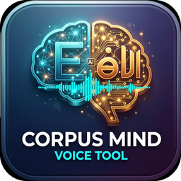

# CorpusMind Voice 🎙️

**Local-first audio → linguistically annotated corpus. A companion tool for [CorpusMind](https://waleedmandour.org/projects/CorpusMind/).**

CorpusMind Voice turns MP3/MP4/WAV files — or live microphone input — into a structured, query-ready corpus with word-level timestamps, phoneme alignment, prosodic features and disfluency annotation. **Everything runs on your machine. No audio, transcript, or metadata ever leaves your device. No cloud APIs are called.**

> The companion corpus analysis environment lives at the [CorpusMind project site](https://waleedmandour.org/projects/CorpusMind/). CorpusMind Voice is designed to hand its outputs straight into CorpusMind with one click.



## ✨ What it does

| Stage | Feature | Implementation |
|-------|---------|----------------|
| 1 · Ingest | Decode any container to 16 kHz mono PCM | PyAV / pydub / ffmpeg |
| 2 · ASR | Word-level timestamps + confidence | faster-whisper `large-v3`, INT8 |
| 3 · Alignment | Word & phoneme boundaries (ms) | Montreal Forced Aligner (Arabic MFA + English ARPA dicts) |
| 4 · Prosody | F0 (50–400 Hz), intensity, jitter, shimmer, HNR | Parselmouth (Praat), optional openSMILE eGeMAPS |
| 5 · Disfluency | Pauses > 200 ms, fillers (`um`/`uh`, `يعني`/`آه`/`إيه`), repeats, false starts, interruptions, lengthenings | rule-based scanner |
| 6 · Structure | SQLite (3 tables) + JSON + TEI/XML | stdlib writers |

**Also included**

- 🖥 **Hardware detection panel** — CPU / RAM / NVIDIA GPU probe, automatic CPU↔CUDA decision with an explicit warning when falling back to CPU (INT8)
- ✏️ **Confidence-coded editor** — every token is green (≥ 0.85) / amber (0.6–0.85) / red (< 0.6); correcting a token flags the utterance for a single-utterance MFA re-alignment
- 🗂 **Corpus metadata form** — embedded into the TEI `<teiHeader>` of every export
- 🌍 **Bilingual UI** — full English + Arabic (RTL, Cairo typeface) interface
- 📴 **PWA** — installable, offline shell via service worker
- 🧠 **Ollama chat panel** — query a *local* LLM about your corpus (never a cloud API)
- 🔗 **CorpusMind launcher** — detects and opens a local CorpusMind installation
- ⏬ **First-run model download** with an in-app progress bar

## 🚀 Quick start (web)

```bash
bun install
bun run db:push
bun run dev          # http://localhost:3000
```

Enable the real ASR/alignment worker (recommended for research use):

```bash
pip install -r python/requirements.txt
# Montreal Forced Aligner (optional, for phoneme-grade alignment):
conda install -c conda-forge montreal-forced-aligner
mfa model download acoustic arabic_mfa && mfa model download dictionary arabic_mfa
mfa model download acoustic english_us_arpa && mfa model download dictionary english_us_arpa
```

Without the Python dependencies the app runs its **built-in simulation engine** — the identical six-stage contract with a demo corpus — so you can explore the full workflow offline. When heavy deps are missing, jobs are clearly labelled *Simulation* in the UI.

## 🖥 Desktop builds (Tauri 2)

Native bundles for **Windows (NSIS/MSI)**, **macOS (dmg/app, arm64 + x86_64)** and **Linux (deb/AppImage)** are produced by GitHub Actions on every push / `v*` tag: `.github/workflows/build.yml`. The desktop shell embeds the Next.js standalone server as a **Node sidecar** and seeds a private SQLite database in the user data dir — same app, fully offline.

Local build (requires Rust + a `node` binary at `src-tauri/binaries/node-<target>`):

```bash
bun run build                 # Next.js standalone
cargo tauri build             # or: bunx tauri build
```

## 📦 Export formats

| Format | Contents |
|--------|----------|
| `*.corpusmind.json` | full records — loads directly with `pandas.json_normalize(..., record_path="tokens")` |
| `*.tokens.csv` | flat token table: index, text, start/end ms, confidence, edited flags |
| `*.tei.xml` | TEI P5 — `<teiHeader>` with your corpus metadata + time-aligned `<w>` elements |
| `*.sqlite` | standalone three-table database (`audio_metadata`, `utterances`, `tokens`) |

## 🔒 Privacy model

- Zero network calls to third parties; ASR, alignment, prosody and export are local processes.
- The service worker caches only the app shell; `/api/*` responses are never cached.
- The optional assistant talks to `http://127.0.0.1:11434` (Ollama) only, and tells you when it is not running.

## 📚 Documentation

- [User Guide (English)](docs/user-guide-en.md) — two pages
- [دليل المستخدم (العربية)](docs/user-guide-ar.md) — صفحتان
- Project site: <https://waleedmandour.org/projects/CorpusMind/>

## 📚 Citing

If you use CorpusMind Voice in research, please cite it — see [citation.cff](citation.cff) (DOI placeholder is filled after the Zenodo deposit) or use the *Cite this repository* button on GitHub.

## ⚖️ License

MIT © Dr. Waleed Mandour. Whisper, MFA and Praat keep their respective licenses.
